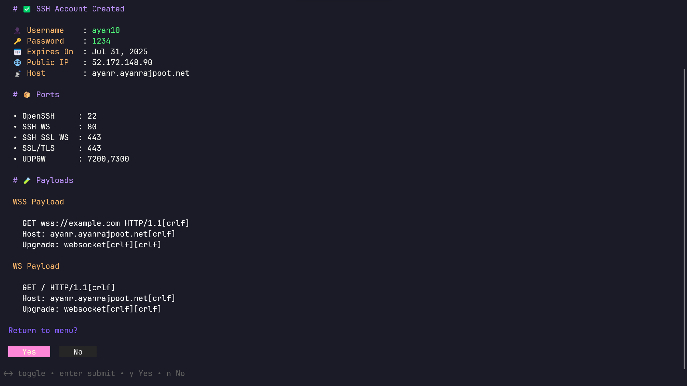
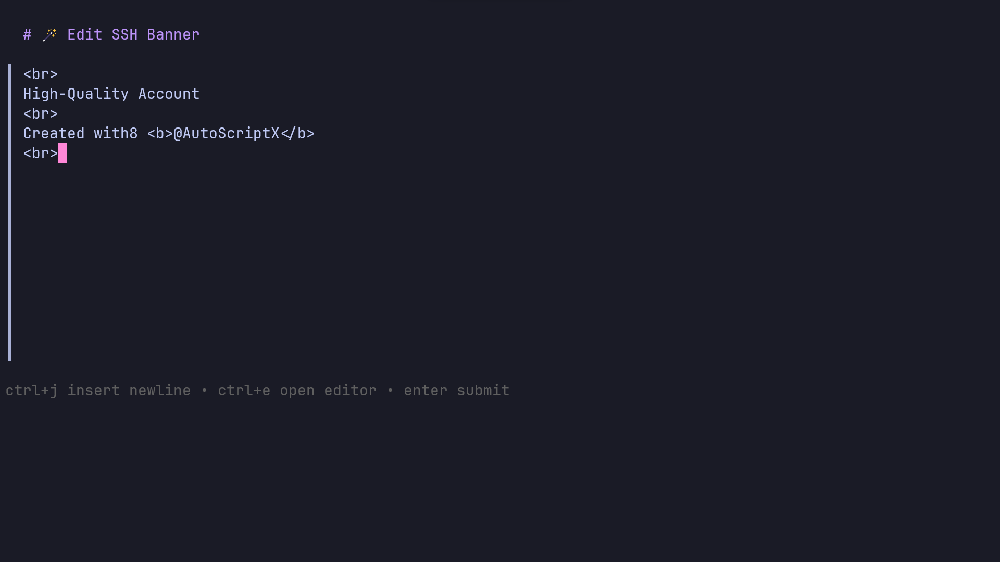
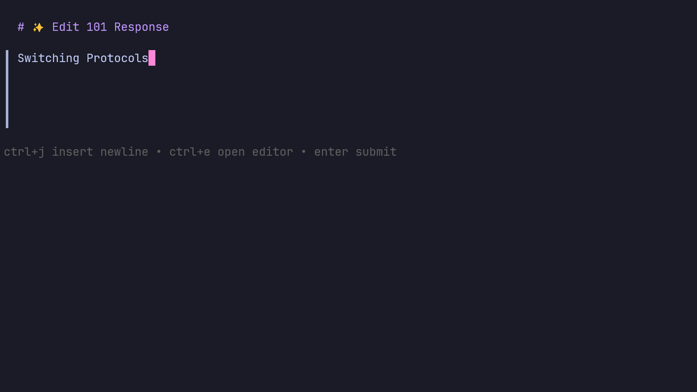
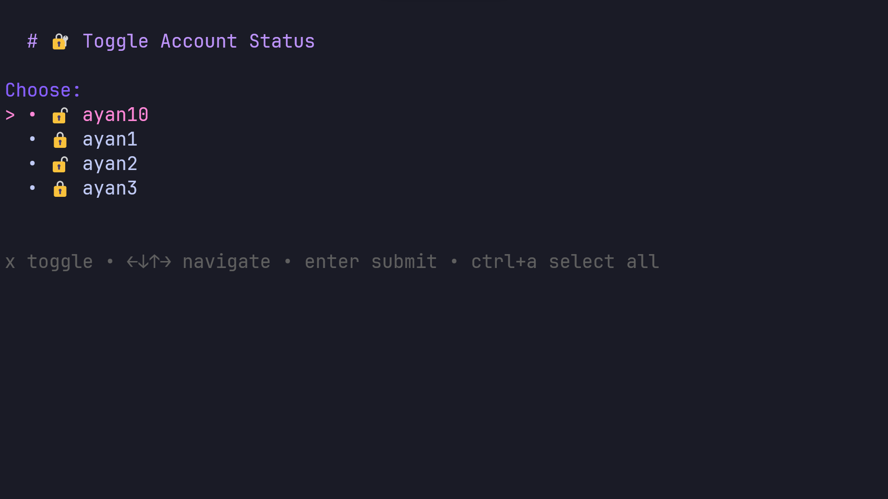
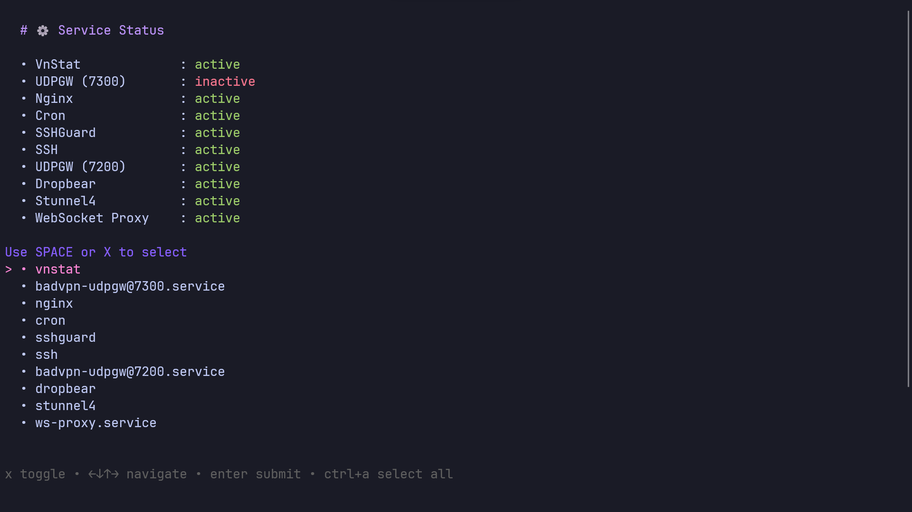
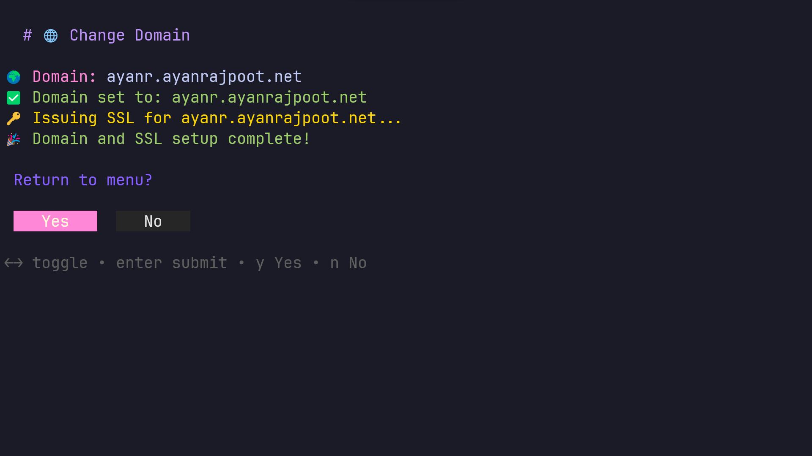

# BgridVPSManager

<p align="left">
    <a href="LICENSE">
        
    </a>
    <a href="#">
        
    </a>
</p>


## Overview

**BgridVPSManager** is a powerful, automated VPS management suite designed to simplify the deployment and administration of SSH, WebSocket, SSL, and related services. It provides a modern, interactive CLI menu for managing user accounts, services, domains, and system information, making it ideal for advanced VPS users.

---

## Images


<div align="center">
  <table>
    <tr>
      <td><br><sub>Main Menu</sub></td>
      <td><br><sub>Create Account</sub></td>
      <td><br><sub>Edit Banner</sub></td>
    </tr>
    <tr>
      <td><br><sub>Edit 101 Response</sub></td>
      <td><br><sub>Lock/Unlock Account</sub></td>
      <td><br><sub>Manage Services</sub></td>
    </tr>
    <tr>
      <td><br><sub>Change Domain</sub></td>
    </tr>
  </table>
</div>


---


## Features

- **Automated Installation**: One-command setup for all dependencies and configurations.
- **SSH & WebSocket Management**: Create, renew, lock/unlock, and delete SSH accounts with WebSocket and SSL support.
- **SlowDNS Support**: DNS tunneling for SSH connections, perfect for bypassing network restrictions.
- **Service Control**: Start, stop, and restart core services (SSH, Nginx, Dropbear, Stunnel, WebSocket Proxy, etc.).
- **Domain & SSL Automation**: Easily set or change your VPS domain and auto-issue SSL certificates.
- **System Information**: View detailed system, network, and service status.
- **Banner & Response Editing**: Customize SSH banners and HTTP 101 responses.
- **Scheduled Maintenance**: Automated cron jobs for rebooting and cleaning expired accounts.
- **Modern & Interactive UI**: Features a user-friendly, interactive CLI menu for seamless VPS management.
 **High Performance WebSocket Proxy**: Handles high load more efficiently than other scripts by using a Go-based WebSocket proxy instead of Python.
- **SSHGuard Protection**: Protects your SSH service from brute-force attacks automatically.

---


## Installation

> **Note:** BgridVPSManager is intended for fresh Ubuntu/Debian VPS environments. **You must run as root.**
> 
> If not already root, run:
> 
> ```bash
> sudo su
> ```

Then install BgridVPSManager with:

```bash
bash <(curl -Ls https://raw.githubusercontent.com/braan1/BgridVPSManager/main/install.sh)
```

Follow the prompts to set your domain and complete the setup.

---

## Usage


After installation, launch the main menu with either command:

```bash
BgridVPSManager
# or
bvm
```

### Menu Options
- Create, delete, renew, lock/unlock SSH accounts
- Edit SSH banner and HTTP 101 response
- Change domain and auto-issue SSL
- Setup and manage SlowDNS (DNS tunneling)
- Manage services (start/stop/restart)
- View system information

---


## Requirements


- Ubuntu/Debian VPS (root access)
- One domain name with an A record pointing to your VPS IP address
- Internet connection

The installer will automatically set up:
- Nginx, Dropbear, Stunnel, SSHGuard, badvpn-udpgw, ws-proxy

---

## Security

- Only run on trusted, clean VPS environments.
- Regularly update your system and BgridVPSManager.

---

## License

This project is licensed under the MIT License. See [LICENSE](LICENSE) for details.
